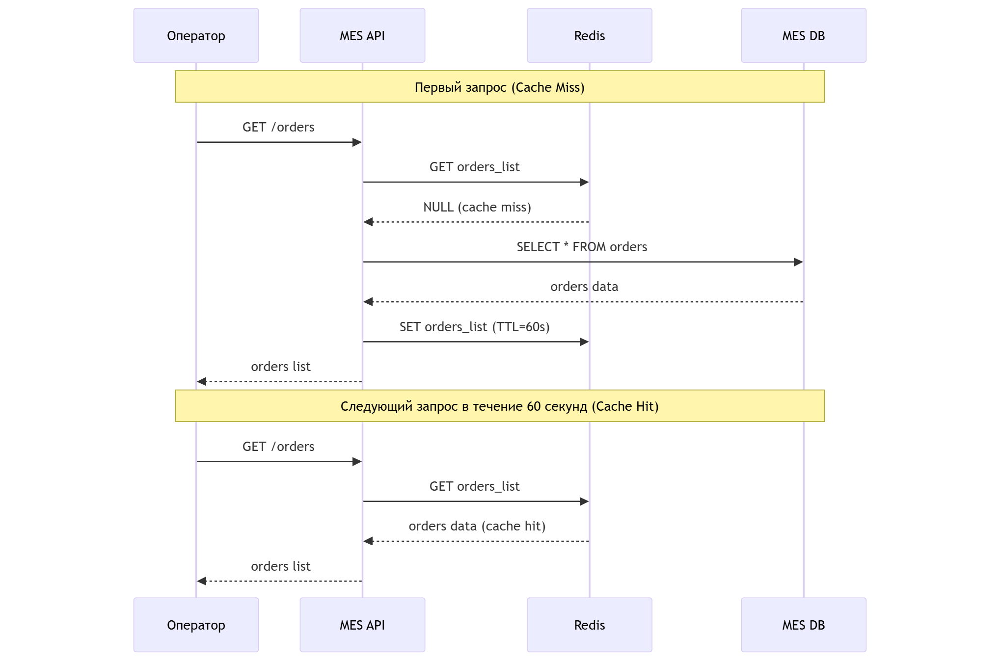

# Задание 5. Кеширование

## Анализ диаграммы системы и её описание

### Какую sчасть системы имеет смысл кешировать

Проблема: MES чувствует себя не очень хорошо. Операторы жалуются на низкую скорость работы со страницей, а новых клиентов не устраивает скорость выполнения заказа.

**Анализ компонентов:**

**Shop API:**
- Список товаров для онлайн-магазина - меняется редко, читается часто
- Расчет стоимости заказа - долгая операция (2-30 минут), результат можно кешировать
- Данные о заказе - часто меняются, кешировать опасно

**CRM API:**
- Список заказов для менеджеров - часто меняется, но можно кешировать с коротким TTL
- Статусы заказов - критичны для бизнеса, кешировать нельзя

**MES API (основная проблема):**
- Дашборд операторов тормозит - здесь нужно кешировать
- Список заказов для операторов - читается постоянно, меняется редко
- Результаты расчета стоимости - долгая операция, результат стабильный

**Базы данных:**
- Shop DB - запросы на чтение списка товаров
- MES DB - запросы на чтение списка заказов (основная проблема производительности)

**Вывод:** Кешировать нужно в первую очередь MES API (дашборд операторов) и результаты расчета стоимости.

## Мотивация

MES API работает медленно - операторы жалуются на тормоза дашборда. Каждый раз при открытии страницы идут тяжелые запросы к MES DB. Расчет стоимости занимает 2-30 минут, но результат для одинаковых файлов всегда одинаковый - можно кешировать.

Кеширование решит:
- Ускорит загрузку дашборда MES для операторов
- Снизит нагрузку на MES DB
- Ускорит повторные расчеты стоимости для похожих заказов
- Улучшит пользовательский опыт

Элементы системы для кеширования:
- Список заказов в MES (читается часто, меняется редко)
- Результаты расчета стоимости (долгая операция, результат стабильный)
- Список товаров в Shop API (меняется редко)

## Предлагаемое решение

### Тип кеширования: серверное

**Почему серверное, а не клиентское:**
- Клиентское кеширование не поможет при первой загрузке страницы
- Операторы работают с разных устройств - кеш не переносится
- Серверное кеширование снижает нагрузку на БД для всех пользователей
- Можно контролировать инвалидацию кеша централизованно

### Паттерн кеширования: Cache-Aside

**Почему Cache-Aside:**
- Простой в реализации - приложение контролирует кеш
- Подходит для read-heavy нагрузки (дашборд MES)
- Приложение может решать, что кешировать, а что нет
- Легко добавить в существующий код без больших изменений

**Почему не Write-Through:**
- Не подходит для нашего случая - у нас проблема с чтением, а не с записью
- Усложняет логику записи данных
- Не решает проблему медленного дашборда

**Почему не Refresh-Ahead:**
- Сложнее в реализации - нужно предсказывать, какие данные понадобятся
- Требует дополнительной логики для обновления кеша
- Избыточно для нашей задачи

**Особенности Cache-Aside:**
- Приложение сначала проверяет кеш
- Если данных нет (cache miss) - читает из БД и кладет в кеш
- Если данные есть (cache hit) - возвращает из кеша
- При обновлении данных - инвалидирует кеш

### Процесс кеширования с указанием сущностей

**Участники:**
- **Оператор** - пользователь MES
- **MES API** - приложение на C#
- **Redis** - кеш-сервер
- **MES DB** - база данных PostgreSQL

**Процесс чтения (Cache-Aside):**
1. Оператор открывает дашборд MES
2. MES API получает запрос GET /orders
3. MES API проверяет Redis: есть ли ключ "orders_list"
4. Если НЕТ (cache miss):
   - MES API читает данные из MES DB
   - MES API сохраняет данные в Redis с TTL=60 секунд
   - MES API возвращает данные оператору
5. Если ЕСТЬ (cache hit):
   - MES API возвращает данные из Redis оператору

**Процесс записи (инвалидация кеша):**
1. Менеджер в CRM подтверждает заказ
2. CRM API обновляет статус в Shop DB
3. CRM API отправляет сообщение в RabbitMQ
4. MES API получает сообщение из RabbitMQ
5. MES API обновляет данные в MES DB
6. MES API удаляет ключ "orders_list" из Redis (инвалидация)
7. При следующем запросе будет cache miss и данные обновятся

## Стратегия инвалидации кеша

### Временная инвалидация (TTL)

**Для списка заказов в MES:**
- TTL = 60 секунд
- Данные меняются не очень часто, но должны быть актуальными
- Если оператор обновит страницу через минуту - увидит свежие данные

**Для результатов расчета стоимости:**
- TTL = 24 часа
- Результат расчета для одинаковых файлов всегда одинаковый
- Можно хранить долго, экономит время на повторных расчетах

**Для списка товаров в Shop API:**
- TTL = 5 минут
- Товары меняются редко, но должны быть актуальными для клиентов

### Инвалидация по ключу

**При изменении статуса заказа:**
- Удаляем ключ "orders_list" из Redis
- Следующий запрос получит свежие данные из БД

**При добавлении нового заказа:**
- Удаляем ключ "orders_list" из Redis
- Новый заказ сразу появится в списке

### Программная инвалидация

**При назначении заказа на оператора:**
- MES API удаляет ключ "orders_list"
- Удаляет ключ "order:{order_id}" для конкретного заказа
- Обновляет данные в БД

### Выбранная стратегия

**Комбинированная:**
- TTL для всех ключей (защита от устаревших данных)
- Программная инвалидация при изменении данных (актуальность)
- Инвалидация по ключу для конкретных сущностей

**Почему комбинированная:**
- TTL защищает от ситуации, когда инвалидация не сработала
- Программная инвалидация дает актуальные данные сразу
- Инвалидация по ключу позволяет обновлять только измененные данные

**Почему не только временная:**
- Данные могут быть неактуальными до истечения TTL
- Оператор может увидеть устаревший список заказов

**Почему не только программная:**
- Если инвалидация не сработала (ошибка, сбой) - данные останутся устаревшими навсегда
- TTL - это safety net

## Сравнение стратегий инвалидации

| Стратегия | Позволяет сделать | Не позволяет сделать | Остальные стратегии |
|-----------|-------------------|----------------------|---------------------|
| **Временная (TTL)** | - Гарантировать актуальность данных через определенное время - Автоматически очищать кеш - Защититься от устаревших данных | - Получить актуальные данные сразу после изменения - Контролировать инвалидацию точечно | - Программная дает актуальность сразу - По ключу позволяет обновлять конкретные сущности |
| **Программная** | - Инвалидировать кеш сразу при изменении данных - Контролировать процесс инвалидации - Обновлять данные точечно | - Защититься от ситуации, когда инвалидация не сработала - Автоматически очищать неиспользуемый кеш | - Временная защищает от устаревших данных - По ключу дополняет программную |
| **По ключу** | - Инвалидировать конкретные сущности - Не трогать остальной кеш - Экономить ресурсы | - Инвалидировать связанные данные автоматически - Работать без знания структуры ключей | - Временная дает автоматическую очистку - Программная дает контроль |

**Вывод:** Лучше всего использовать комбинацию всех трех стратегий - временная защищает от сбоев, программная дает актуальность, по ключу позволяет точечно обновлять данные.

## Заключение

Кеширование MES API с помощью Redis и паттерна Cache-Aside решит проблему медленного дашборда операторов. Комбинированная стратегия инвалидации (TTL + программная + по ключу) обеспечит баланс между актуальностью данных и производительностью.

**Ожидаемые результаты:**
- Загрузка дашборда MES < 1 секунды (сейчас 5-10 секунд)
- Снижение нагрузки на MES DB на 70-80%
- Ускорение повторных расчетов стоимости в 100 раз
- Улучшение пользовательского опыта операторов
